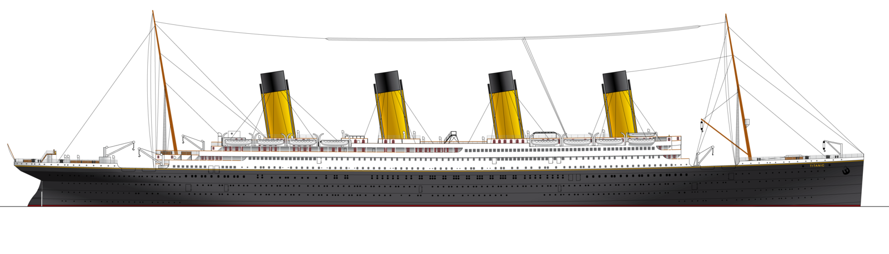

```{r setup, include=FALSE}
knitr::opts_chunk$set(echo = FALSE, warning = FALSE, message = FALSE)
```


## Introduction

* The presentation is a final product of Course project at **Developing Data Products** at Coursera.
* It consists of this **Pitch presentation** available at https://dejanl.github.io/DDP-Course-Project/ and **Shiny application** available at https://dejanl.shinyapps.io/Titanic/.
* The source code for pitch presentation and Shiny application is available at https://github.com/DejanL/DDP-Course-Project.


## The purpose of an application

* Let's **play a game**. 
* It's **1912** and you're considering buying a ticket for **Titanic's maiden voyage**. 
* See you **chances of survival** based on your personal characteristics (socio-economic status, sex and age).


## Implementation details

* The following code represents the **initial values** in Shiny application, used for **GLM prediction**, returning **predicted probability**.

```{r eval=TRUE, echo=TRUE}
library(titanic); library(dplyr)
data.train <- titanic_train %>%
  mutate(Sex = factor(Sex, levels = c("female", "male")),
         Pclass = factor(Pclass, levels = 1:3, 
                         labels = c("Upper", "Middle", "Lower"))
    ) %>% select(Pclass, Sex, Age, Survived) %>%
    filter(complete.cases(.))
model <- glm(Survived ~ ., 
             family = binomial(link = 'logit'), data = data.train)
data.predict <- data.frame(Pclass = "Lower", Sex = "male", Age = 20)
predict(model, data.predict, type = 'response') %>% as.numeric()
```


## Do you have what it takes?



<center>
I dare you to visit the Shiny application at 

https://dejanl.shinyapps.io/Titanic/ 

and find out if luck is on your side.
</center>